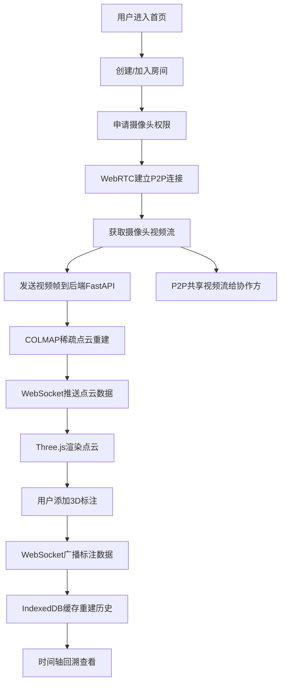
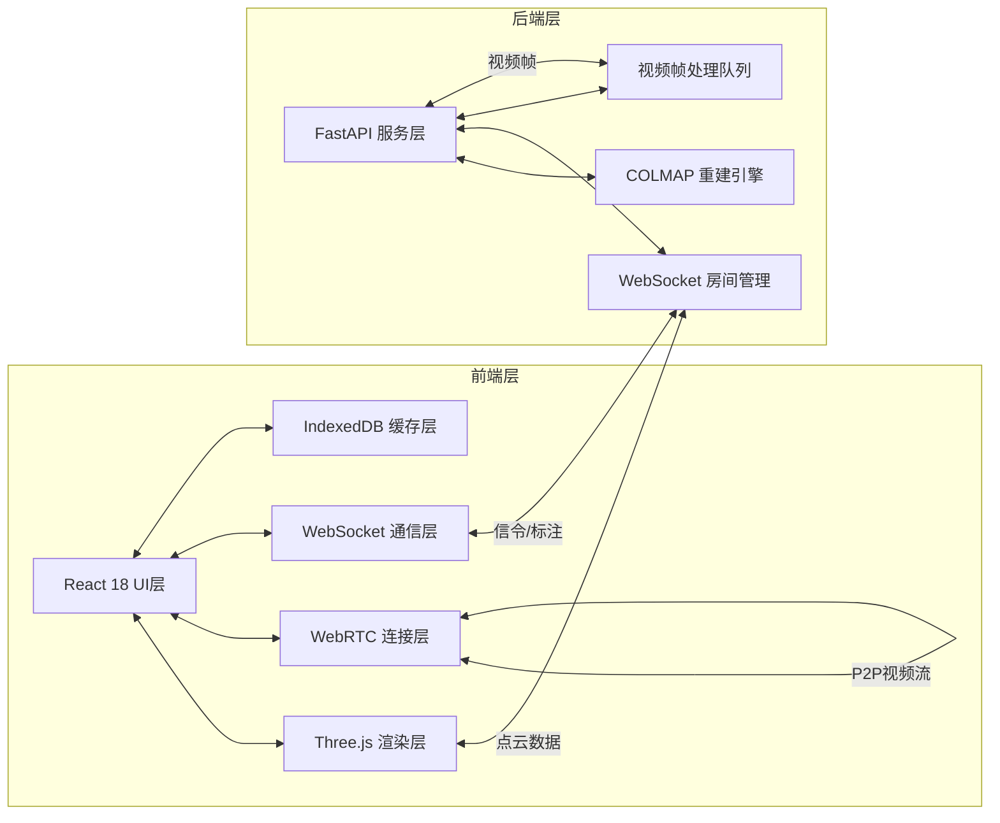

## 1. 产品概述

WebRTC联合WebGL的实时点云重建与协作标注系统，支持多用户通过P2P连接共享摄像头视频流，服务端基于COLMAP进行三维稀疏点云重建，前端通过Three.js实现点云可视化与3D协作标注。

- 面向三维重建从业者、研究人员和协作团队，解决实时三维重建、多人协作标注的痛点
- 技术价值：实现Web端无插件实时三维重建，结合WebRTC低延迟传输与WebGL高性能渲染

## 2. 核心功能

### 2.1 用户角色

| 角色 | 加入方式 | 核心权限 |
|------|----------|----------|
| 房间创建者 | 创建房间并获取房间号 | 启动/停止重建、管理房间、标注权限 |
| 协作参与者 | 输入房间号加入 | 查看点云、添加标注、同步视频流 |
| 观察者 | 输入房间号加入（只读） | 仅查看点云和标注，无编辑权限 |

### 2.2 功能模块

1. **主界面**：房间创建/加入、摄像头配置、连接状态显示
2. **点云渲染视图**：Three.js 3D场景、点云渲染、视角控制
3. **视频流面板**：本地摄像头预览、远程用户视频流显示
4. **标注工具栏**：箭头标注、球体标记、文字标注、标注管理
5. **时间轴面板**：重建历史时间轴、版本回溯、快照管理
6. **连接状态面板**：WebRTC连接状态、WebSocket状态、房间成员列表

### 2.3 页面详情

| 页面名称 | 模块名称 | 功能描述 |
|----------|----------|----------|
| 首页/登录页 | 房间管理 | 创建房间、加入房间、输入用户名、摄像头权限申请 |
| 主工作区 | 3D点云视图 | Three.js渲染点云、鼠标交互旋转缩放、点云着色模式切换 |
| 主工作区 | 视频流面板 | 显示本地和远程摄像头画面，支持视频流开关 |
| 主工作区 | 标注工具栏 | 选择标注类型（箭头/球体/文字）、修改标注颜色/大小、删除标注 |
| 主工作区 | 时间轴面板 | 显示重建进度时间轴、点击跳转历史版本、保存快照、版本对比 |
| 主工作区 | 侧边信息栏 | 显示点云统计信息（点数、相机位姿）、房间成员列表、连接状态 |

## 3. 核心流程

用户进入系统后，创建或加入房间，系统申请摄像头权限并通过WebRTC建立P2P连接。视频流同时发送给远端用户和后端重建服务。后端COLMAP处理视频帧生成稀疏点云，通过WebSocket推送到前端。前端Three.js实时渲染点云，用户可添加3D标注，标注数据通过WebSocket广播到房间内所有用户。重建历史自动存入IndexedDB，支持时间轴回溯查看。

## 4. 用户界面设计

### 4.1 设计风格

- **主色调**：深空蓝 (#0A192F) 作为背景，科技青 (#64FFDA) 作为强调色，辅助色为紫色 (#7C3AED)
- **按钮风格**：圆角矩形按钮，悬停时发光效果，主按钮带有渐变边框
- **字体**：标题使用 Space Grotesk，正文使用 JetBrains Mono，等宽字体增强科技感
- **布局风格**：暗色科技风，玻璃态面板，主视图居中，侧边栏和工具栏悬浮
- **视觉元素**：网格线背景，扫描线动画效果，发光边框，粒子效果点缀

### 4.2 页面设计概述

| 页面名称 | 模块名称 | UI元素 |
|----------|----------|--------|
| 首页 | 房间管理卡片 | 玻璃态卡片、发光输入框、脉冲动画按钮、渐变文字标题 |
| 主工作区 | 3D视图容器 | 全屏Canvas、十字准星、角落状态指示器、悬浮操作按钮 |
| 主工作区 | 视频流面板 | 圆角视频容器、在线状态绿点、用户名称标签、静音/关闭按钮 |
| 主工作区 | 标注工具栏 | 图标按钮组、颜色选择器、滑块控制、选中高亮发光效果 |
| 主工作区 | 时间轴 | 轨道式时间轴、关键帧标记点、播放控制按钮、缩放滑块 |
| 主工作区 | 侧边信息栏 | 可折叠面板、统计数据卡片、成员列表头像、连接状态指示灯 |

### 4.3 响应性

- Desktop-first设计，主工作区在大屏上充分利用空间
- 侧边栏可折叠，视频流面板可拖拽调整位置和大小
- 时间轴支持滚轮缩放，标注工具栏可适配不同屏幕高度
- 触控设备支持手势操作（双指缩放、单指旋转点云）

### 4.4 3D场景指导

- **环境**：纯黑背景配合深空雾效，营造宇宙空间感，无HDRI避免干扰点云显示
- **光照**：环境光 + 两个方向光，确保点云从各角度都清晰可见，点云本身使用自发光材质
- **相机设置**：PerspectiveCamera，初始距离根据点云边界自动调整，支持OrbitControls环绕观察
- **交互**：点击点云选择标注位置，拖拽添加箭头标注，滚轮缩放，右键平移
- **动画**：点云加载时的粒子聚合动画，标注添加时的弹性缩放入场，时间轴切换时的平滑过渡
- **后处理**：Bloom发光效果增强科技感，FXAA抗锯齿，点云选中时的辉光高亮
- **性能**：使用PointsMaterial + BufferGeometry，点大小根据距离动态调整，LOD策略控制渲染质量

