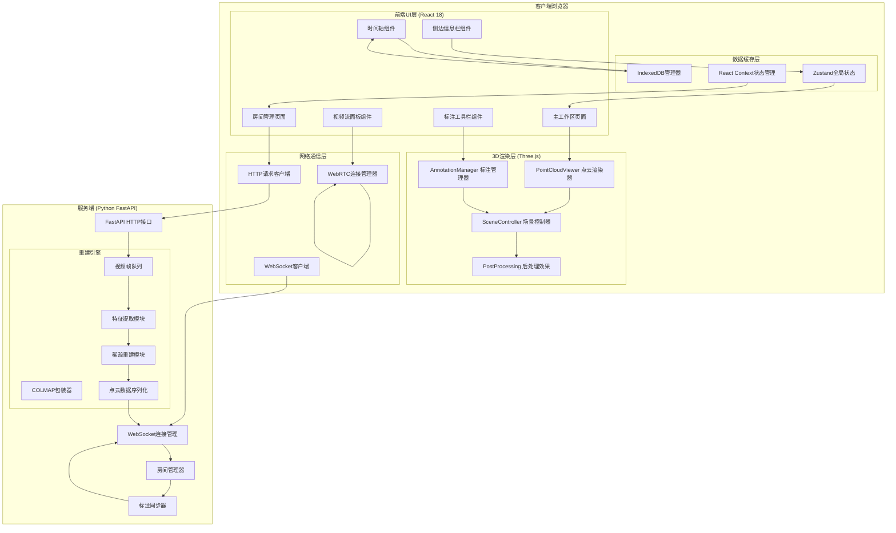
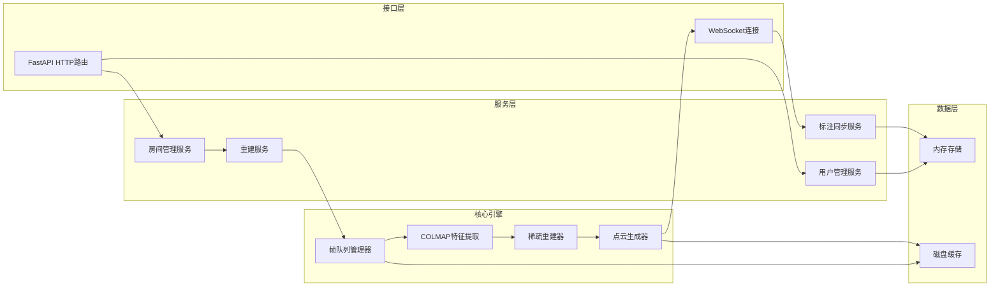
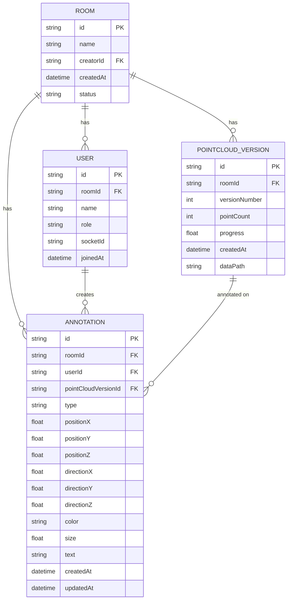

## 1. 架构设计



## 2. 技术描述

- **前端**：React 18 + TypeScript + Vite + TailwindCSS 3 + Zustand
- **3D渲染**：Three.js + @react-three/fiber + @react-three/drei + @react-three/postprocessing
- **WebRTC**：simple-peer 库封装
- **WebSocket**：原生WebSocket + 重连机制
- **本地存储**：IndexedDB (idb库封装)
- **后端**：Python 3.10 + FastAPI + Uvicorn + WebSockets
- **三维重建**：COLMAP (通过subprocess调用) + OpenCV
- **异步任务**：asyncio + Queue

## 3. 路由定义

| 路由 | 页面组件 | 用途 |
|------|----------|------|
| / | RoomPage | 首页，创建/加入房间 |
| /room/:roomId | WorkspacePage | 主工作区，点云渲染和标注 |

## 4. API定义

### 4.1 HTTP接口

```typescript
// 创建房间
POST /api/room/create
Request: { username: string }
Response: { roomId: string, userId: string, token: string }

// 加入房间
POST /api/room/join
Request: { roomId: string, username: string, role: 'creator' | 'collaborator' | 'viewer' }
Response: { userId: string, token: string, users: User[], pointCloud?: PointCloudData }

// 上传视频帧
POST /api/frame/upload
Headers: { Authorization: Bearer {token}, Room-Id: {roomId} }
Request: multipart/form-data { frame: File, timestamp: number, frameIndex: number }
Response: { success: boolean, queued: boolean }

// 获取点云历史列表
GET /api/pointcloud/history?roomId={roomId}
Response: { versions: PointCloudVersion[] }

// 获取指定版本点云
GET /api/pointcloud/:versionId
Response: { points: number[], colors: number[], timestamp: number }
```

### 4.2 WebSocket消息类型

```typescript
type WebSocketMessage =
  | { type: 'user_join'; data: User }
  | { type: 'user_leave'; data: { userId: string } }
  | { type: 'pointcloud_update'; data: PointCloudData }
  | { type: 'annotation_add'; data: Annotation }
  | { type: 'annotation_update'; data: Annotation }
  | { type: 'annotation_delete'; data: { annotationId: string } }
  | { type: 'reconstruct_status'; data: { status: 'idle' | 'processing' | 'done', progress: number } }
  | { type: 'webrtc_offer'; data: { from: string, to: string, offer: RTCSessionDescriptionInit } }
  | { type: 'webrtc_answer'; data: { from: string, to: string, answer: RTCSessionDescriptionInit } }
  | { type: 'webrtc_ice'; data: { from: string, to: string, candidate: RTCIceCandidateInit } }
```

## 5. 服务端架构图



## 6. 数据模型

### 6.1 数据模型定义



### 6.2 IndexedDB数据结构

```typescript
// IndexedDB Store 定义
const dbSchema = {
  roomInfo: { key: 'roomId', indexes: ['createdAt'] },
  pointCloudVersions: { key: 'versionId', indexes: ['roomId', 'timestamp', 'versionNumber'] },
  pointCloudData: { key: 'versionId', indexes: ['roomId'] },
  annotations: { key: 'annotationId', indexes: ['roomId', 'versionId', 'userId', 'createdAt'] },
  localFrames: { key: 'frameId', indexes: ['roomId', 'timestamp'] }
};

// 点云数据结构
interface PointCloudData {
  versionId: string;
  roomId: string;
  timestamp: number;
  versionNumber: number;
  points: Float32Array;  // [x, y, z, x, y, z, ...]
  colors: Float32Array;  // [r, g, b, r, g, b, ...]
  pointCount: number;
  cameraPoses?: CameraPose[];
}

// 标注数据结构
interface Annotation {
  annotationId: string;
  roomId: string;
  userId: string;
  userName: string;
  pointCloudVersionId: string;
  type: 'arrow' | 'sphere' | 'text';
  position: [number, number, number];
  direction?: [number, number, number];  // for arrow
  color: string;
  size: number;
  text?: string;
  createdAt: number;
  updatedAt: number;
}

// 用户数据结构
interface User {
  userId: string;
  roomId: string;
  name: string;
  role: 'creator' | 'collaborator' | 'viewer';
  isOnline: boolean;
  hasVideo: boolean;
  videoStreamId?: string;
}
```
